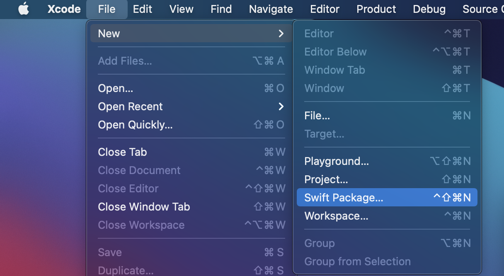
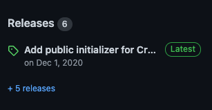
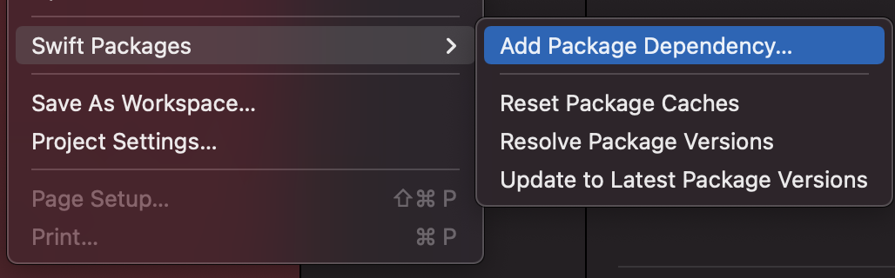
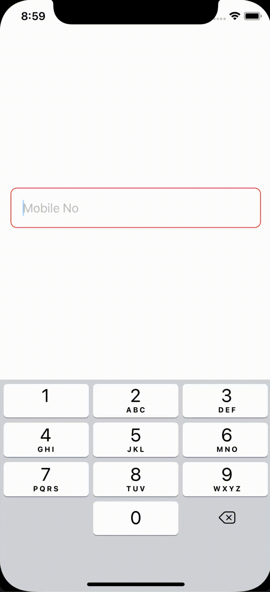

> 간단하게 나만의 SwiftUI Theme 프레임워크를 만들어보자.

# 1. 테마 프레임워크의 필요성

- 최근 회사에서 같은 디자인의 테마를 가진 어플 여러개를 혼자 개발의 맡게 되면서, 반복 작업과 개발 소요 기간을 줄이기 위해, 공통적으로 쓰이는 Elementes들을 프레임워크화를 시키는 작업을 진행하였다. 예를 들자면 공통적으로 쓰이는 텍스트 필드, 버튼 등의 요소들이 있다.

- 프레임워크 개발을 처음 시도하면서 처음에 헷갈렸던 부분들이 있어 정리하는 차원에서 글을 남기고자 한다.

## 2. Swift Package 프로젝트 생성

- Xcode를 실행 후 File - New - Swift Package (Ctrl + Cmd + Shift N)를 통해 새로운 패키지를 만들도록 하자.
  

- 이름은 자유롭게 입력한다. (필자의 경우는 **SwiftPMExample**으로 하였다)
- 추가로, *.xcodeproj 파일에서 작업을 원한다면 터미널로 프레임워크의 Directory로 이동 후 **swift package generate-xcodeproj** 명령어로 생성한 뒤 작업을 진행해도 된다.

## 3. Package.swift 수정

- 자동으로 **Package.swift** 파일이 생성되었을텐데, 약간의 수정이 필요하다.
- 이번 포스팅의 경우에는 iOS 13 이상에서 사용할 수 있는 SwiftUI의 TextField 레이아웃 하나를 만들어 볼 예정이기 때문에, 해당 파일의 names 아래에 Platform 제약을 추가해준다.

  ```Swift

  // Package.swift

  let package = Package(
    name: "SwiftPMExample",
    platforms: [.iOS(.v13)]
    // ...
  )

  ```

## 4. Test 코드 수정

- 이번 포스팅에서는 UI Test, Unit Test를 다루지 않을 예정이기 때문에, 테스트 코드를 주석 처리하거나 지워준다.
- 테스트 코드는 **[Tests] - [패키지 이름+Tests.swift] - [패키지 이름+Tests.swift]**에 있다. `ex) Tests/SwiftPMExampleTests/SwiftPMExampleTests.swift`

## 5. 텍스트필드를 위한 구조체 선언

- 휴대폰 번호 입력을 위한 간단한 Validation과 포맷팅을 포함한 텍스트필드를 만들어 볼 예정이다.
- SwiftUI에서는 View 요소에 대해 struct를 주로 사용하기 때문에, 프레임워크 전체를 구성해줄 struct를 **Sources - SwiftPMExample - SwiftPMExample.swift** 파일에 public으로 선언 후 초기화 해준다.

  ```Swift

  // SwiftPMExample.swift

  public struct SwiftPMExample {
    public init() {}
  }

  ```
- SwiftUI를 이용할 것이기 때문에 SwiftUI를 import해준다.
- SwiftPMExample 안에 TextFields의 구조체를 하나 더 선언해줄 예정인데, **TextFields.swift** 파일을 추가로 만들고, SwiftPMExample의 extension을 이용하여 TextField struct를 선언 후 초기화해준다. (물론 public)
- 이후 해당 파일 하단에서 SwiftPMExample.TextFields의 extension을 선언 후 작업 할 예정이다.
- 우선 에러가 발생하더라도 아래 처럼 작성 후 이후 단계로 진행한다.

  ```Swift

  // TextFields.swift

  import SwiftUI

  extension SwiftPMExample {

    public struct TextFields {

      public init() {}

    }

  }

  extension SwiftPMExample.TextFields {

    public struct MobileNo: View {

      public init() {}

    }

  }

  ```

## 6. 텍스트필드 꾸미기
- SwiftUI의 View 프로토콜을 채택하였는데 body가 없어서 에러가 뜨는 것이니, 텍스트필드를 위한 String Binding과, Placeholder, 그리고 텍스트 필드를 포함한 body를 선언해준다.
- Placeholder를 원하지 않는 경우도 있을 수 있기 때문에, 초기화 parameter에서 초기 값을 선언해준다.
- 그리고 휴대폰 번호 검증을 위한 flag 선언과 더불어 약간의 스타일링을 해주자.
- 참고로 간단한 예제이므로 Regex를 이용하지 않고, 글자 수만 검증할 것이다.
  ```Swift
  public struct MobileNo: View {
        
        @Binding var text: String
        let placeholder: String
        
        /*
          휴대폰 번호 유효성에 따른 테두리 스타일링을 위한 Flag
        */
        @State private var isValid: Bool = false
        
        public init(text: Binding<String>, placeholder: String = "") {
            self._text = text
            self.placeholder = placeholder
        }
        
        public var body: some View {
            TextField(placeholder, text: $text)
                .textContentType(.telephoneNumber)
                .keyboardType(.numberPad)
                .padding()
                .overlay(
                    RoundedRectangle(cornerRadius: 8.0)
                        .stroke()
                        /*
                        휴대폰 번호가 유효하면 Blue, 아니면 Red 색을 가진
                        RoundedRectangle로 테두리를 만들어준다.
                        */
                        .foregroundColor(self.isValid ? .blue : .red)
                )
        }
    }
  ```
- 미리 한번 맛보기로 보고싶다면 아래의 코드를 최하단에 추가 후 빌드(Cmd + B)를 하고, .constant 안의 값을 바꾸면서 보면 된다.
- 프리뷰 화면이 열리지 않는다면 단축키(Opt + Cmd + Return)를 이용해보자.
  ```Swift
  struct ContentView_Previews: PreviewProvider {
    static var previews: some View {
        SwiftPMExample.TextFields.MobileNo(text: .constant("Hello World"), placeholder: "Placeholder")
            .padding()
    }
  }
  ```

## 7. 휴대폰 번호 포맷팅 및 검증하기

- SwiftUI에서 선언형 프로그래밍의 도입으로 기존에 사용하던 delegate 패턴을 사용하지 않고, View Model 없이 View에서만 컨트롤 할 예정이기 때문에, 간단하게 Combine Framework의 Just를 이용해서 입력 값을 제어해 볼 것이다.
- 상단에 Combine을 import 해준다.
- 그 후, 앞서 만든 텍스트 overlay 다음에 onReceive를 이용하여 제어할 예정이기 때문에, 이후에 아래의 코드를 삽입해 주고 바디 밖에 **formatMobileNo**라는 메소드도 하나 선언해준다.
- onReceive는 파라미터의 Publisher 값이 변화할 때 마다 해당 클로저의 메소드를 실행시켜준다. (해당 메소드의 자세한 내용은 [애플의 공식문서](https://developer.apple.com/documentation/swiftui/view/onreceive(_:perform:))를 참고해보자.)
  ```Swift
  public var body: some View {
    // ...
      .onReceive(Just(self.text)) { _ in
      self.formatMobileNo()
    }
  }
  ```

- 간단한 검증과 더불어 포매팅을 아래의 메소드를 통해 할 수 있다. (물론 Regex를 이용하여 보다 더 정확한 검증을 구현할 수 있다.)
- 또한, 클로저의 escaping 파라미터를 이용하여 함수형 프로그래밍으로 메소드를 만들어도 된다.

  ```Swift
  /// 텍스트 포맷팅 및 유효성 확인
  private func formatMobileNo() {
      /*
      입력 중 첫 하이픈 추가
      */
      if self.text.count == 4 && !self.text.contains("-") {
          self.text.insert("-", at: self.text.index(self.text.startIndex, offsetBy: 3))
      }
      
      /*
      입력 중 두번째 하이픈 추가
      */
      if self.text.count == 9 && self.text[self.text.index(self.text.startIndex, offsetBy: 8)] != "-" {
          self.text.insert("-", at: self.text.index(self.text.startIndex, offsetBy: 8))
      }
      
      /*
      삭제 중 하이픈 삭제
      글자 수 초과 시 마지막 글자 삭제
      */
      if (self.text.count == 9 && self.text.last == "-")
          || (self.text.count == 4 && self.text.last == "-")
          || (self.text.count > 13) {
          self.text.removeLast()
      }
      
      /*
      유효성 Flag 확인
      */
      self.isValid = self.text.count == 13
      
  }
  ```

## 8. 배포하기

- 굳이 공개할 라이브러리가 아니라면 배포하지 않고 라이브러리를 다른 프로젝트에 끌어다 놓고 xcodeproj의 general에서 Framework에 추가해주면 된다.
- 배포는 보통 GitHub를 이용하여 하고, 터미널을 이용하여 해당 패키지의 Root Directory로 이동 후 GitHub에 Repository를 생성 후 Push한다.
- Git 초기화가 되어있지 않다면 아래의 명령어 또는 [깃허브의 공식문서](https://docs.github.com/en/free-pro-team@latest/github/importing-your-projects-to-github/adding-an-existing-project-to-github-using-the-command-line)를 참고하자.
  ```bash
  git init
  git add .
  git commit -m "Initial Commit"
  git remote add origin https://github.com/<계정>/<Repo 이름>
  git push -u origin master
  ```
- 이후 깃허브의 해당 Repository로 이동하여 우측의 Release를 통해 배포하면 다른 프로젝트에서도 SwiftPM을 통하여 해당 프레임워크/라이브러리를 손쉽게 사용할 수 있다. (Release Tag를 작성하지 않더라도 Branch로 끌어올 수 있긴 하다.)

  

## 9. 다른 프로젝트에서 사용하기

- Xcode에서 프로젝트 생성 후 **Files - Swift Packages - Add Package Dependency** 메뉴를 클릭 후 해당 라이브러리 GitHub의 주소를 입력 후 가져오면 된다.
- 자세한 방법은 [이 링크](https://developer.apple.com/documentation/xcode/adding_package_dependencies_to_your_app)를 참고하자.
  
- 이후 해당 라이브러리를 import한 뒤 사용하면 된다.
  ```Swift
  import SwiftUI
  import SwiftPMExample

  struct ContentView: View {
      
      @State private var text = ""
      
      var body: some View {
          SwiftPMExample.TextFields.MobileNo(
            text: $text, 
            placeholder: "Mobile No"
          )
          .padding()
      }
  }
  ```
  
