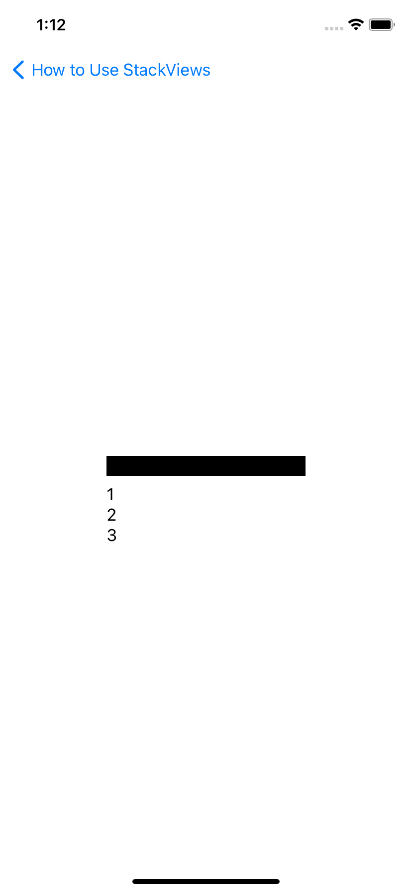
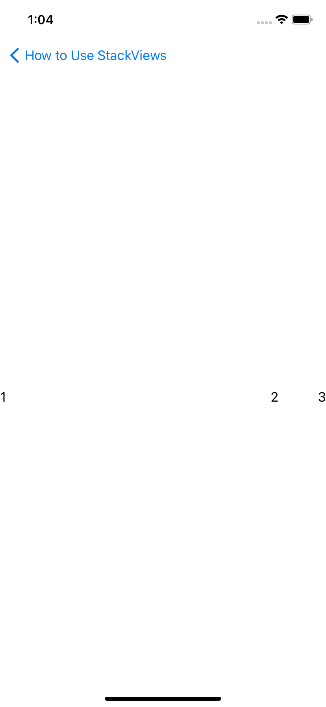
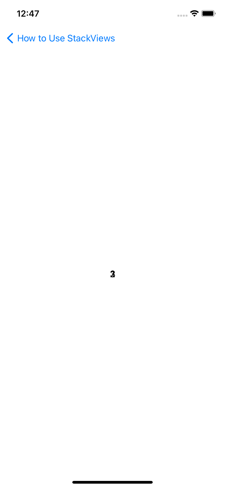
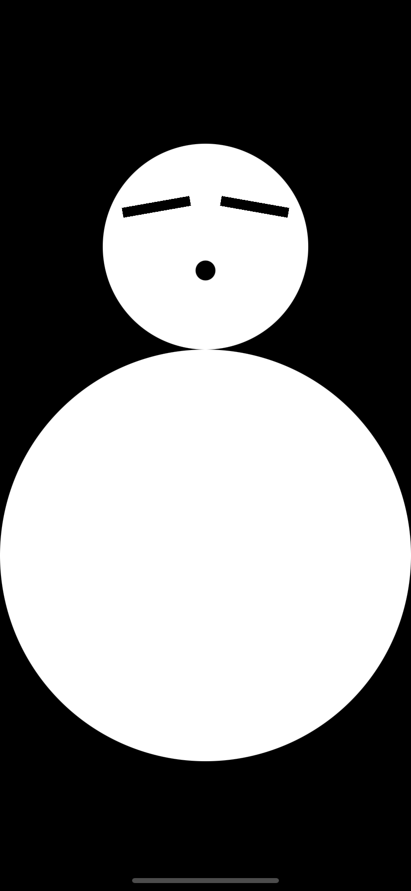

> StackView의 종류

# 1. StackView란?

- 스택뷰란 여러 뷰의 컬렉션을 세로 또는 가로로 레이아웃 하기 위해 사용하는 인터페이스이다.
- 특히 오토 레이아웃에 있어서 큰 영향력을 발휘하고, 디바이스의 오리엔테이션에 따라 다이나믹하게 움직이는 뷰를 설계할 때 필수적인 요소이다.
- 웹에서 사용하는 Flex를 떠올리면 쉽게 이해할 수 있을듯 하다.
- 또한 UIKit으로 개발을 할 때는 선택적으로 사용을 했지만, SwiftUI에서는 거의 필수적인 요소라고 생각한다.

## 2. StackView의 종류

- [VStack](https://developer.apple.com/documentation/swiftui/vstack)
  - VStack 안의 자식들(children)을 세로로 정렬하는 뷰이다.
- [HStack](https://developer.apple.com/documentation/swiftui/hstack)
  - HStack 안의 자식들(children)을 세로로 정렬하는 뷰이다.
- [ZStack](https://developer.apple.com/documentation/swiftui/zstack)
  - ZStack 안의 자식들(children)을 중첩(Overlay)하는 뷰이다.
- [Spacer](https://developer.apple.com/documentation/swiftui/spacer)
  - StackView 내에서 나머지 공간을 채워줄 때 사용한다.
  - StackView의 종류는 아니지만, 경험상 개발할 때 개발하는 내내 VStack / HStack과 함께 항상 따라다녔다.

## 3. 사용법

- 간단하게 각 스택뷰를 선언하고, 클로저 형태로 클로저 내에 내가 원하는 각종 뷰 요소들을 넣어주면 된다.

## 4. StackView의 파라미터

- VStack
  ```Swift
  init(alignment: HorizontalAlignment = .center, spacing: CGFloat? = nil, content: () -> Content)
  ```
- HStack
  ```Swift
  init(alignment: VerticalAlignment = .center, spacing: CGFloat? = nil, content: () -> Content)
  ```
- ZStack

  ```Swift
  init(alignment: Alignment = .center, content: () -> Content)
  ```

- Spacer

  ```Swift
  init(minLength: CGFloat?)
  ```

- alignment: 각 스택 안의 자식 뷰들을 어떻게 정렬할 건지 속성을 부여해줄 수 있다.
  - 애플의 공식문서에서 발췌한 위의 파라미터를 보면 alignment 속성이 없으면 전부 .center로 배치된다
- spacing: 자식 뷰들의 간격을 부여해줄 수 있다. (ZStack은 중첩이기 때문에 해당 파라미터가 없다.)
  - 마찬가지로 파라미터 값을 부여해주지 않으면 nil이 되어 자식뷰들 사이의 간격이 없어진다.
- content: 각 뷰 안에 들어갈 자식 뷰를 넣어준다.
- Spacer의 minLength: 최대로 줄어들 수 있는 길이이다.

## 5. 사용 예

- VStack

  - VStack 내의 모든 뷰 요소가 세로로 정렬된다.
  - alignment를 leading으로 선언하여 뷰의 요소들이 모두 왼쪽으로 붙었다.

    ```Swift
    VStack(alignment: .leading) {

      Rectangle()
              .frame(width: 200, height: 20)

      Text("1")

      Text("2")

      Text("3")
    } //: V
    ```

    

- HStack

  - HStack 내의 모든 뷰 요소가 가로로 정렬된다.
  - Spacer로 인해 1과 2 사이의 간격이 벌어졌고,
  - spacing을 50으로 선언하여 각 자식뷰의 사이가 50 포인트씩 벌어진 상태이다.

    ```Swift
    HStack(spacing: 50) {

      Text("1")

      Spacer(minLength: 0)

      Text("2")

      Text("3")
    } //: H
    ```

    

- ZStack

  - ZStack 내의 모든 뷰 요소가 중첩된다.

    ```Swift
      ZStack {

        Text("1")

        Text("2")

        Text("3")
      } //: Z
    ```

    

- 번외로 VStack, HStack, ZStack 등을 모두 활용하면 아래 처럼 눈사람도 만들 수 있다.
  

### 예제 프로젝트

- [GitHub](https://github.com/aaronLab/swiftui-exercise/tree/main/HowToUseStackView)
- [.zip](https://downgit.github.io/#/home?url=https://github.com/aaronLab/swiftui-exercise/tree/main/HowToUseStackView)
- [눈사람 Github](https://github.com/aaronLab/swiftui-exercise/tree/main/Snowman)
- [눈사람 .zip](https://downgit.github.io/#/home?url=https://github.com/aaronLab/swiftui-exercise/tree/main/Snowman)
